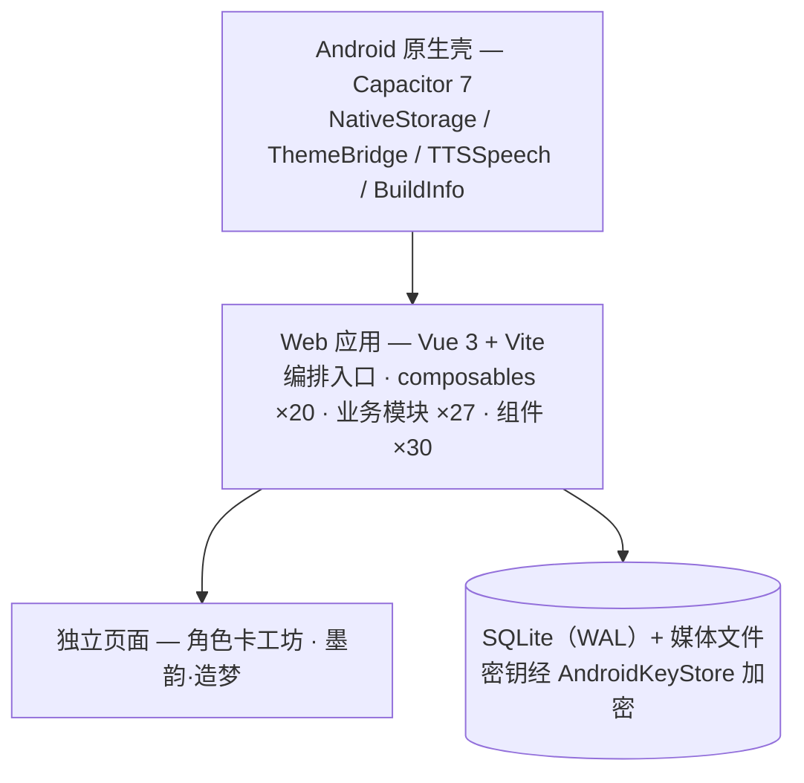

<div align="center">

# 🎭 Roleplay Hub

[](https://github.com/Litishs/Roleplay-Hub/releases/latest)
[](https://creativecommons.org/licenses/by-nc/4.0/)
[](https://github.com/Litishs/Roleplay-Hub/releases/latest)
[](https://vuejs.org/)
[](https://capacitorjs.com/)
[](https://tailwindcss.com/)

**本地优先的 AI 角色扮演 App** —— 与角色对话、共写剧情、把记忆慢慢养成。<br>
对话、角色卡与所有设置只留在你的设备上，调用大模型 API 时才需要联网。

[⬇️ 下载最新版 APK](https://github.com/Litishs/Roleplay-Hub/releases/latest)

</div>

## ✨ 功能一览

| 能力 | 说明 |
| --- | --- |
| 🎭 **对话与演出** | 流式输出、CoT 折叠、楼层候选左右滑、剧情分支树、沙箱交互卡片、UI 模板换装 |
| 🧠 **记忆系统** | 滚动总结 + 本地向量召回（模型内置、离线可用）+ 角色 / 关系 / 伏笔信息卡 |
| 🗂️ **角色与世界观** | PNG / JSON / JSONL 角色卡保真往返、角色卡工坊、世界书、正则脚本引擎 |
| 📖 **墨韵·造梦** | AI 小说工坊：定好世界观与角色逐章生成，TXT 随进随出，稿件存本地 |
| 🖼️ **多模态** | 聊天发图识图（≤3 张）、AI 生图（NAI Diffusion 4.5） |
| 🔊 **双 TTS** | 系统引擎随时开口，云端引擎（OpenAI 兼容 /audio/speech）音色讲究 |
| 🔌 **多服务商** | STA1N / DeepSeek / OpenRouter / SiliconFlow / 百炼 / 智谱 / 自定义端点，Key 分供应商加密存储 |
| 🔒 **数据与运维** | SQLite 全本地 + 增量持久化、备份恢复完整性校验、应用内更新、万相广场 |

> 请求超时、生图参数等均可在设置中滑动调节，支持一键恢复默认。

## 🌱 与上游的不同

fork 自 STA1N 的开源项目 [STA1N156/RP-Hub](https://github.com/STA1N156/RP-Hub)：上游奠定页面设计与核心玩法，本仓库把整套体验装进 Android——

**Capacitor 原生壳 · SQLite 本地库 · AndroidKeyStore 加密 · 备份恢复 · 应用内更新 · CI 自动签名发布 · 本地向量记忆 · 双 TTS · UI 模板 · 楼层候选滑动**

识图 / 生图 / 墨韵·造梦等能力与上游同源，一并致谢。

<details>
<summary><b>🏗️ 架构概览</b></summary>
<br>



</details>

<details>
<summary><b>🛠️ 快速开始</b></summary>
<br>

**普通用户**：直接[下载最新 Release APK](https://github.com/Litishs/Roleplay-Hub/releases/latest)，进入「设置」选 API 提供商、填入 Key、选模型即可开聊。

**开发者构建**：Node.js 18+，Android 构建建议使用仓库内 `.toolchains` 提供的 JDK 21 与 SDK。

```bash
npm install                 # 安装依赖
npm test                    # 契约测试
npm run build:web           # 构建 Web 资源到 dist/
npm run android:sync        # 构建并同步到 Android 工程
npm run android:debug       # debug 包 -> debug_apk/
npm run android:release     # 正式包 -> 仓库根目录
```

正式包签名需自行生成 `android/keystore/roleplay-hub-release.keystore` 并配置 `android/keystore.properties`（两者均不入库，请自行备份）。

</details>

## 📜 渊源与许可

本仓库最初 fork 自 **STA1N** 的开源项目 [STA1N156/RP-Hub](https://github.com/STA1N156/RP-Hub)，在此持续演进。原始项目的页面设计、角色卡系统与核心功能构思均出自原作者之手，原始代码与设计的全部版权归 STA1N 所有，由衷感谢其无私开源。

沿用 **[CC BY-NC 4.0](./LICENSE)** 协议：可自由共享与演绎，须保留署名并标明修改，**不得用于任何商业目的**；如需商业授权，请联系原作者 STA1N。
